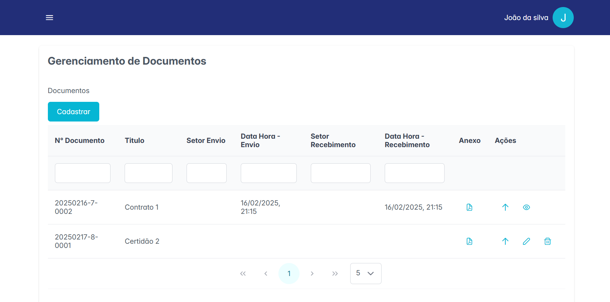
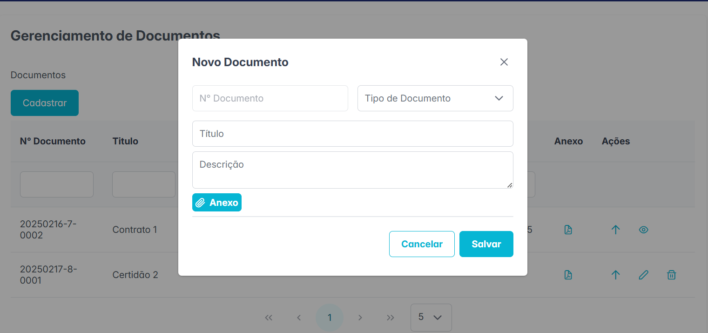
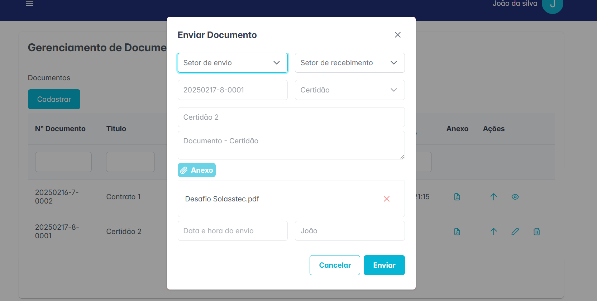
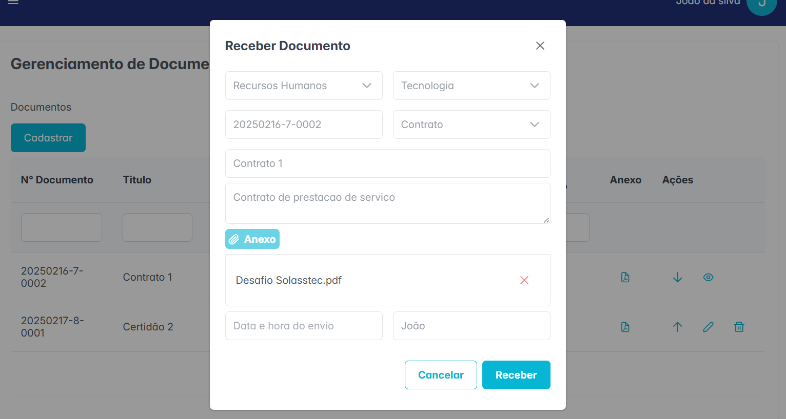
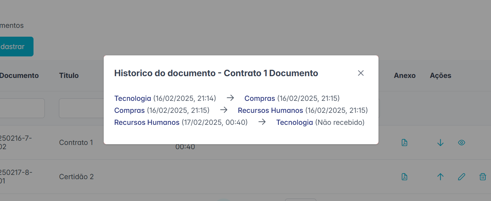
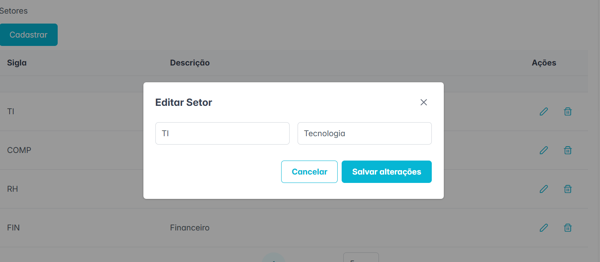
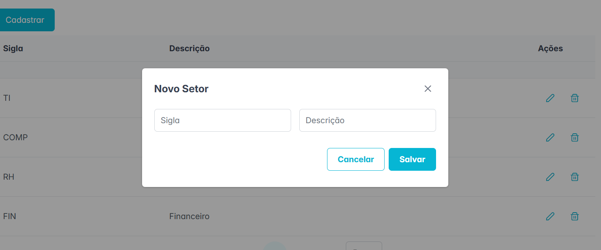

# 📄 Sistema de Tramitação de Documentos

Bem-vindo ao **Sistema de Tramitação de Documentos**! Este projeto tem como objetivo facilitar a gestão e o acompanhamento de documentos dentro de um orgão público, permitindo a tramitação eficiente entre diferentes setores.

## 🚀 Sobre o Projeto

O **Sistema de Tramitação de Documentos** foi desenvolvido para otimizar o fluxo de documentos dentro de órgãos públicos. Com ele, é possível:

- Criar, editar, visualizar e acompanhar o histórico de tramitações de um documento;
- Controlar a movimentação dos documentos entre setores;
- Cadastrar e visualizar setores
- Melhorar a transparência e rastreabilidade dos documentos.

## 📸 Telas do Sistema

Na tela de Gerenciamento de Documentos é possível visualizar uma lista de documentos que ainda não foram enviados, e que ainda estão pendentes de recebimento. A tramitação de documento obedece as seguintes regras:
- Ao cadastrar um novo documento, o usuário poderá editá-lo ou deletá-lo antes de enviar.
- Após o documento ser enviado não será possível editar ou deletar o mesmo.
- Após enviar o documento para outro setor, o documento poderá ser recebido e/ou visualizar seu histórico de tramitações.
- Após receber o documento, o mesmo documento pode ser reenviado para outro setor, bastando clicar no botão de enviar e selecionar o setor de destino.
- O setor que enviou o documento não poderá ser o mesmo que recebe o documento








No menu lateral do sistema é possível navegar entre as telas de Gerenciamento de Documentos e de Setores. Na tela de Gerenciamento de setores é possível visualizar a lista de setores, cadastrar e editar os setores.





## 🛠️ Tecnologias Utilizadas

Este projeto foi desenvolvido utilizando as seguintes tecnologias:

- **React** + **Vite**
- **PrimeReact**
- **TypeScript**
- **Axios**
- **React Router**

## 🏗️ Como Instalar e Executar o Projeto

### 🔽 Clonar o Repositório

```sh
git clone git@github.com:kamilapantoja/sistema-tramitacao-documentos-frontend.git
```

### 📂 Acessar a pasta do projeto

```sh
cd sistema-tramitacao-documentos-frontend
```

### 📦 Instalar as dependências

```sh
npm install
```

### 🚀 Rodar o projeto localmente

```sh
npm run dev
```

Depois disso, acesse o sistema no navegador pelo link:

```
http://localhost:5173
```

